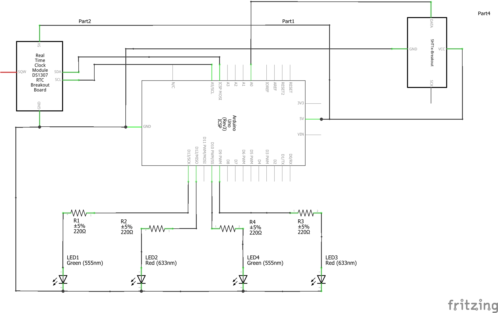
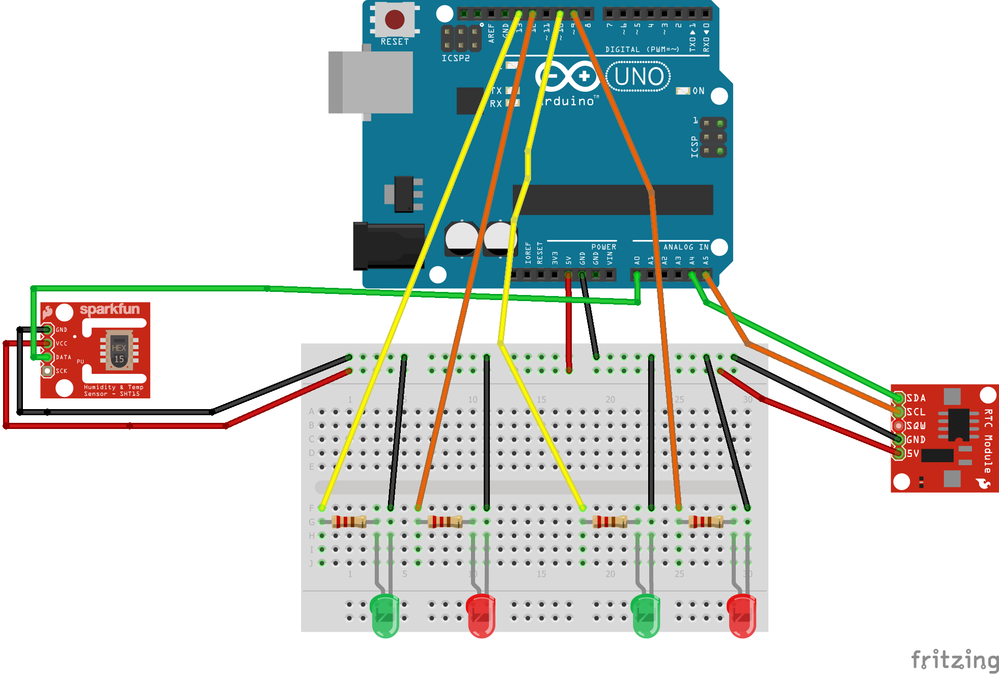

# CeasMeteo
## Descriere generala
#### Proiectul presupune implementarea unui modul capabil sa monitorizeze parametri meteorologigici precum temperatura si umiditatea. Controlul acestor parametri este foarte important in cazul incintelor in care acestia pot varia doar cu valori mici (de exemplu: o sera sau o ciupercarie).
## Mod de functionare
#### Pentru initializare este necesara conectarea la un sistem de calcul care permite comunicarea seriala cu placuta Arduino. Prin intermediul comunicarii seriale, utilizatorul seteaza limitele de temperatura si presiune dorite in incinta prin simpla introducere de la tastatura a valorilor solicitate. Dupa configurare, modulul va functiona intr-un regim mixt. Prin regim mixt se intelege ca modulul poate functiona fara a mai fi necesara comunicarea seriala pentru o analiza calitativa a parametrilor. 
#### In cazul in care un parametru masurat se regaseste in limitele setate, se va aprinde cate un LED verde corespunzator acestuia. Depasirea limitelor setate unui parametru va fi semnalata prin aprinderea unui LED rosu. Daca LED-urile ofera doar o imagine calitativa a rezultatelor masuratorilor, pe monitorul serial poate fi consultata o detaliere a rezultatelor masuraturilor. La fiecare 30 de secunde, senzorul de temperatura si umiditate va transmite rezultatele masuratorilor.  Vor fi afisate: temperatura (masurata in grade Celsius) si umiditatea relativa(masurata in procente) din incinta, momentul la care s-a realizat masuratoarea (data, ziua saptamanii, ora), respectiv limitele de temperatura si umiditate setate de utilizator. O scurta prezentare a modului de functionare poate fi consultata in urmatorul videoclip: https://www.youtube.com/watch?v=u2lJJYeJQEE
## Implementare
#### Proiectul a fost implementat dupa urmatoarea schema electrica, cu mentiunea ca au fost folosite componente diferite dar cu functii similare in cazul modulului RTC, respectiv senzorului de temperatura si umiditate:

#### De asemenea, a fost realizata o simulare in aplicatia Fritzing:

### Componentele utilizate pentru implementarea fizica:
### - Arduino Uno
### - Senzor de temperatura si umiditate DH11
### - Modul RTC DS3231 AT24C32
### - conectori, rezistente 220 ohmi, LED-uri rosii si verzi
### 
### In ceea ce priveste utilizarea placutei Arduino, codul care ruleaza pe aceasta utilizeaza bibliotecile <RTClib.h> si <dht.h> (pentru achizitia datelor de la modulul RTC, respectiv senzorul de temperatura si umiditate) si <EEPROM.h>, biblioteca utilizata pentru stocarea in memoria EEPROM a limitelor setate. Astfel, in cazul in care este intrerupta alimentarea modulului, valorile limitelor nu vor fi pierdute, la  pornirea ulterioara intreruperii acestea vor fi incarcate din memoria EEPROM.
